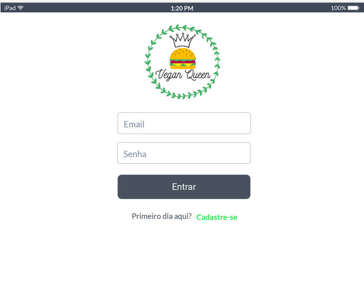
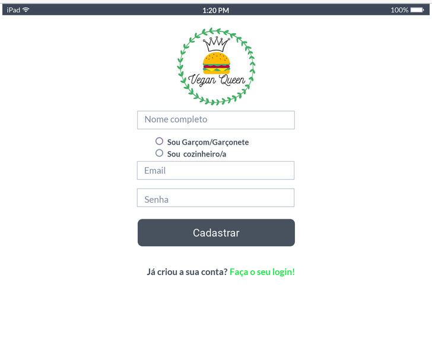
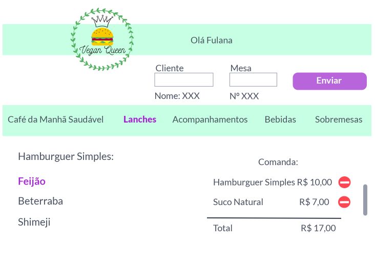
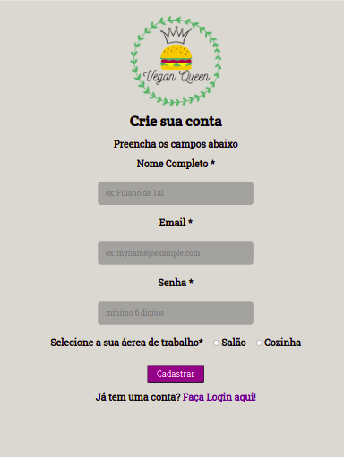
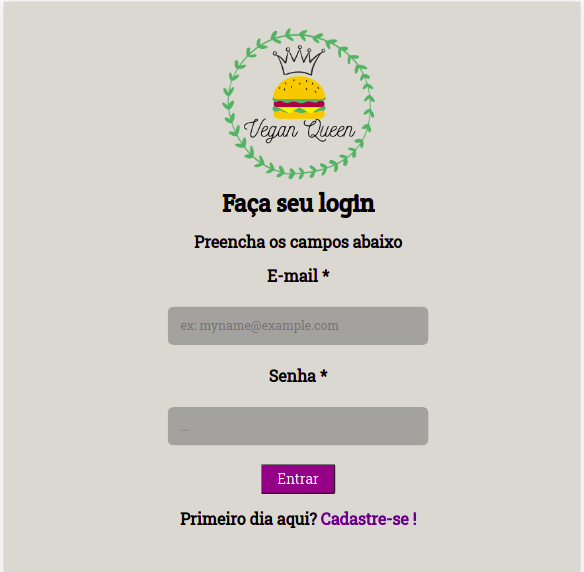
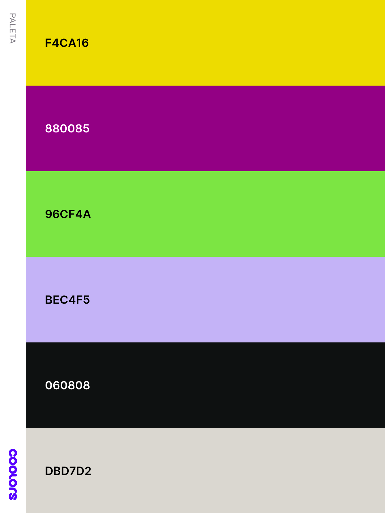
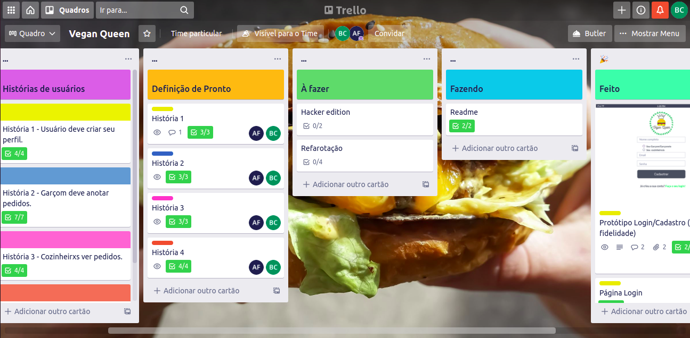

# Vegan Queen :hamburger:

## Índice

- [Apresentação](#apresentação)
- [Temática](#temática)
- [Protótipos](#protótipos)
- [Testes](#testes)
- [Usuários](#usuários)
- [Design](#design)
   * [Cores](#cores)
   * [Logotipo](#logotipo)
   * [Interface](#interface)
- [Planejamento](#planejamento)
- [Desenvolvimento](#desenvolvimento)
- [Pontos de Melhoria](#pontos-de-melhoria)
- [Devas](#devas)

---

## Apresentação

*Vegan Queen* é uma aplicação web desenvolvida sob demanda do cliente fictício Restaurande Vegan Queen, seu objetivo é automatizar o sistema interno do restaurante e melhorar os procedimentos de solicitação de pedido, envio para preparo e entrega ao cliente final. Ele se dá no formato de cardápio e comanda digital, acompanhamento do preparo e entrega de cada solicitação e histórico de todos pedidos entregues ao cliente final. Este projeto foi desenvolvido durante o bootcamp da [Laboratória](https://www.laboratoria.la/br), com finalidade de aprendizagem e enriquecimento dos conhecimentos das alunas.

 

## Temática

A temática escolhida para definição do cliente foi de restaurante vegano, cujos procedimentos internos e produtos servidos pela empresa seguem a cultura do veganismo. De acordo com a [Associação Brasileira de Veganismo](https://veganismo.org.br/), o significado deste conceito é:

          “ Veganismo é uma filosofia e estilo de vida que busca excluir, na medida do possível
            e praticável, todas as formas de exploração e crueldade contra animais na alimentação,
            vestuário e qualquer outra finalidade e, por extensão, que promova o desenvolvimento e
            uso de alternativas livres de origem animal para benefício de humanos, animais e meio 
            ambiente.”

Desta forma, ambas desenvolvedoras tem afinidade com o modo de vida vegano e escolhemos este tema para nosso cliente, alnhando nossa prestação de serviços aos valores do contratante.

 

## Protótipos

Os protótipos da página foram realizados através do MarvelApp, segue imagens e links para testes:

[Teste aqui](https://marvelapp.com/prototype/fg13c84/screen/76693657)

[Teste aqui](https://marvelapp.com/prototype/fg13c84/screen/76905175)

## Testes

Após feito os protótipos, realizamos testes com potenciais usuários e recebemos os seguintes feedbacks e as respectivas resoluções que realizamos:

:heavy_exclamation_mark: Barra de rolagem não acessível pelo desktop  
:heavy_check_mark: Definir produto será usado somente via tablet onde a rolagem será via touch

:heavy_exclamation_mark: Botoẽs de navegação do salão muito pequenos e amontuados  
:heavy_check_mark: Definir usabilidade do produto em modo horizontal

### Interface

A interface da aplicação finalizou da seguinte maneira:

[Visite a aplicação aqui](https://vegan-queen-git-main-anafreitas-br.vercel.app/)

Para testar a sua funcionalidade utilize os seguintes usuários testes:

Salão
- email: joão_teste@vq.com
- senha: 123456

Cozinha
- email: maria_teste@vq.com
- senha: 123456

## Usuários

Os usuários do Vegan Queen serão os funcionários do restaurante, cujas áreas de trabalho são da cozinha e do salão, profissionais da área de alimentação, cuja funções principais são garçnete/garçom e cozinheira/cozinha.

### **Histórias de Usuário**

O aplicativo foi realizado baseado nas seguintes histórias de usuários e suas respectivos critérios de aceitação:

**1**. Usuário deve ter seu perfil (login/senha) para acessar o sistema  
Eu como funcionário do restaurante quero entrar na plataforma e ver apenas a tela importante para o meu trabalho. 

**Critérios de aceitação: **
* Criar login e senha. 
* Registar tipo de usuário (cozinha / salão),  login e senha. 
* Entrar na tela correta para cada usuário.

**2**. Garçom/Garçonete deve poder anotar o seu pedido 
Eu como garçom/garçonete quero poder anotar o meu pedido saber o valor de cada produto e poder enviar o pedido para a cozinha para ser preparado. 

**Critérios de aceitação: **
* Anotar o nome e mesa. 
* Adicionar produtos aos pedidos. 
* Excluir produtos. 
* Ver resumo e o total da compra. 
* Enviar o pedido para a cozinha (guardar em algum banco de dados). 
* Funcionar bem e se adequar a um tablet. 

**3**. Chefe de cozinha deve ver os pedidos 
Eu como chefe de cozinha quero ver os pedidos dos clientes em ordem, poder marcar que estão prontos e poder notificar os garçons/garçonetes que o pedido está pronto para ser entregue ao cliente. 

**Critérios de aceitação: **
* Ver os pedidos à medida em que são feitos. 
* Marcar os pedidos que foram preparados e estão prontos para serem servidos. 
* Ver o tempo que levou para preparar o pedido desde que chegou, até ser marcado como concluído. 

**4**. Garçom/Garçonete deve ver os pedidos prontos para servir 
Eu como garçom/garçonete quero ver os pedidos que estão prontos para entregá-los rapidamente aos clientes. 

**Critérios de aceitação: **
* Ver a lista de pedidos prontos para servir. 
* Marque os pedidos que foram entregues. 

## Design 

O layout da aplicação foi pensado da seguinte forma:

### Cores

A paleta de cores foi decidica baseando-se nos alimentos que o restaurante serve, ilustração feita pela ferramenta Coolors:

 

Sendo amarelo do pão, roxo de beterraba, verde das verduras, cinza esbranquiçado dos cogumelos shimeji e paris e preto do gergelim

### Logotipo

O logo foi criado pelo Canva, seguindo a paleta de cores e a temática realeza.

 

## Planejamento

O planejamento foi realizado através do Trello, seguindo o período de 4 sprints, onde cada história de usuário se deu em 1 sprint.

## Tecnologias

Para desenvolvimento deste projeto foram utilizadas: 
- HTML5, 
- CSS3, 
- Vanilla JavaScript, 
- React JS/React Hooks/react-router-dom, 
- Vercel (deploy),
- Marvel (protótipo) 
- API Burger Queen fornecida por Swagger, acessivel [clicando aqui](https://lab-api-bq.herokuapp.com/api-docs/#/). 
- A aplicação foi realizada com conceito de tablet first e Single Page Application (SPA).

## Pontos de melhoria

Para as próximas refatorações iremos implementar:

:pushpin:Armazenar valor total de cada pedido no histórico  
:pushpin:Contagem de tempo do preparo de cada pedido  
:pushpin:Refatorar layout do cardápio e comanda 

## Devas

Este projeto foi desenvolvido com muito carinho pelas desenvolvedoras:

:smiley_cat:[Bianca Sherika](https://www.github.com/BiancaSherika) 
:smile_cat:[Ana Freitas](https://www.github.com/anafreitas-br)
